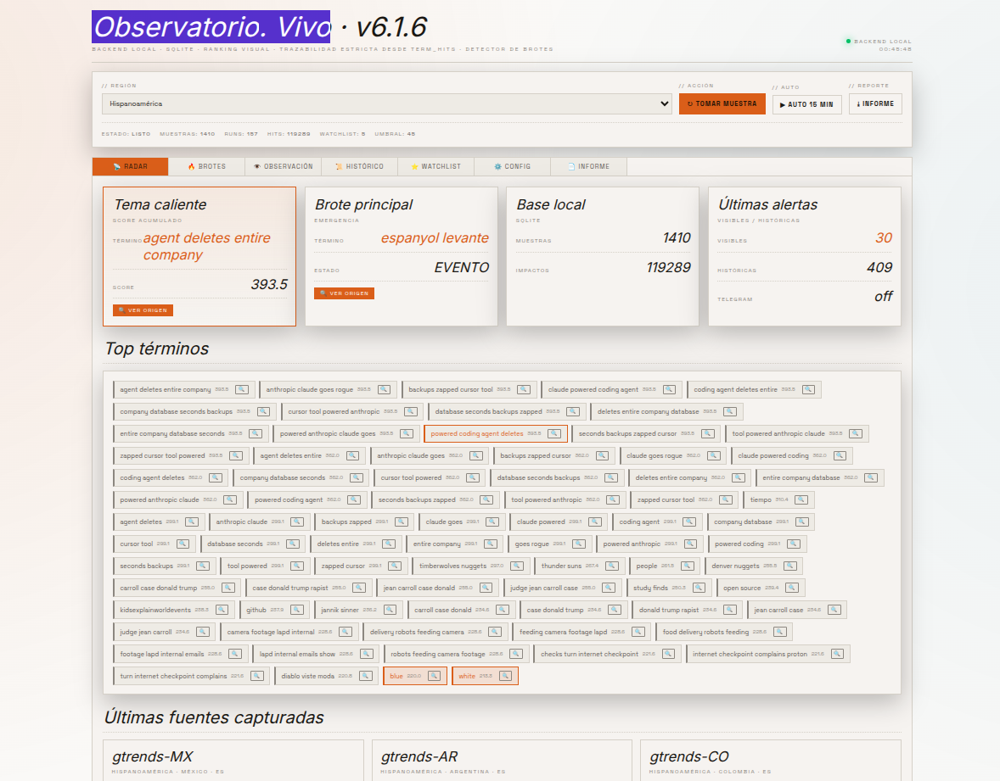
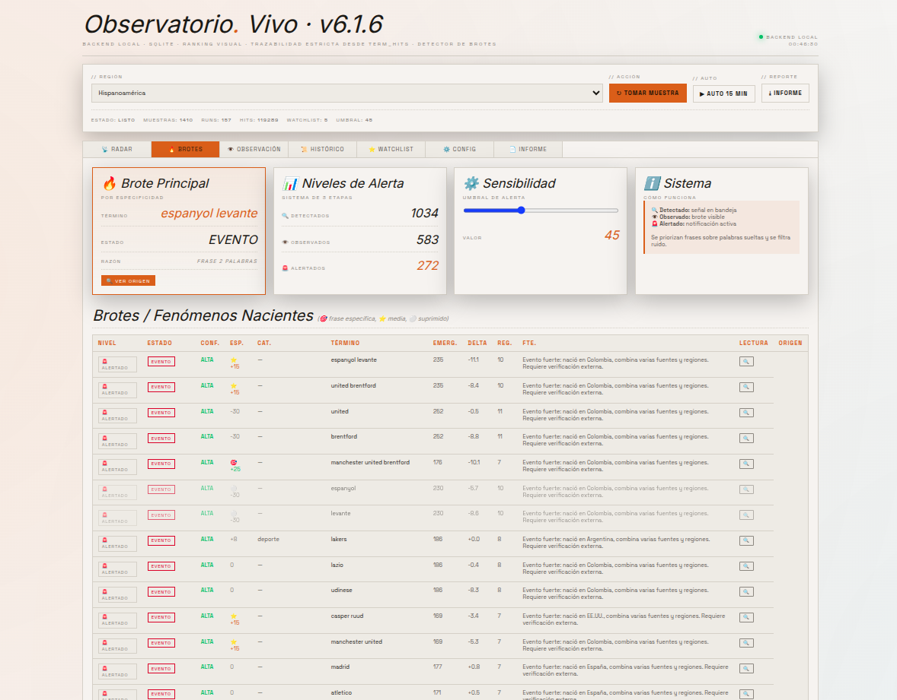
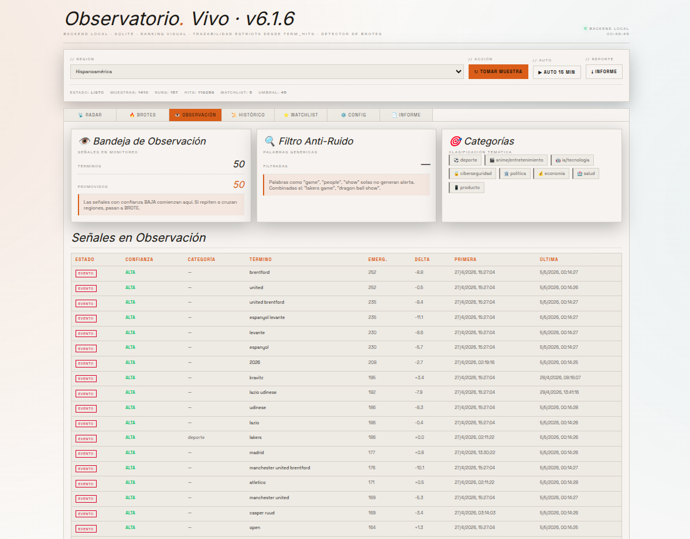
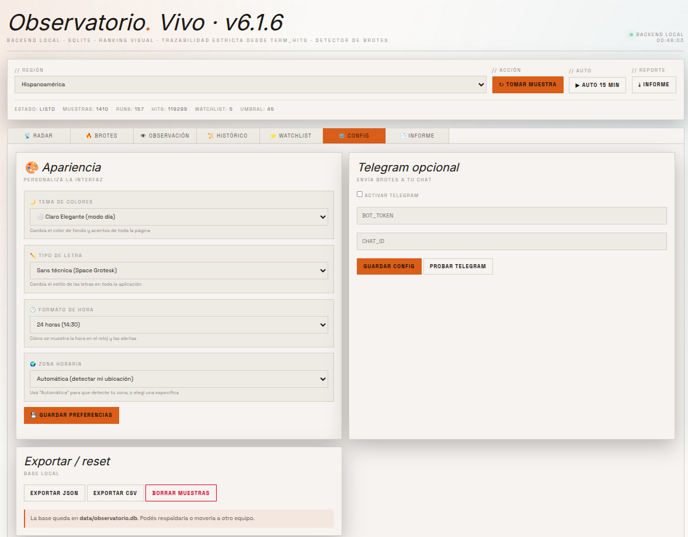

# Observatorio Vivo v6 · Backend Local

> 🌐 **English version**: [README_EN.md](README_EN.md)

<p align="center">
  
  
  
  
</p>

<p align="center">
  <strong>Sistema de inteligencia de tendencias en tiempo real con detección de brotes y alertas automáticas.</strong>
</p>

---

## Tabla de Contenidos

- [Visión General](#visión-general)
- [Arquitectura del Sistema](#arquitectura-del-sistema)
- [Comportamiento del Sistema](#comportamiento-del-sistema)
- [Instalación](#instalación)
- [Uso](#uso)
- [API Reference](#api-reference)
- [Configuración](#configuración)
- [Estructura del Proyecto](#estructura-del-proyecto)

---

## Visión General

**Observatorio Vivo v6** es un sistema backend local que monitorea tendencias emergentes en múltiples fuentes públicas, detecta fenómenos nacientes ("brotes") y genera alertas inteligentes. Diseñado para investigadores, periodistas y analistas de datos que necesitan identificar señales débiles antes de que se conviertan en tendencias masivas.

### Características Principales

| Feature | Descripción |
|---------|-------------|
| **Múltiples Fuentes** | Wikipedia Pageviews, Google Trends RSS, Reddit, Mastodon, Hacker News |
| **Detección Inteligente** | Algoritmo propio de scoring con 8 métricas combinadas |
| **Persistencia Local** | Base de datos SQLite con WAL mode para alta concurrencia |
| **Alertas Configurables** | Sistema interno + notificaciones Telegram opcionales |
| **Agrupación Semántica** | Alias para unir variantes léxicas del mismo fenómeno |
| **Watchlist Personalizada** | Seguimiento de términos específicos de interés |
| **Exportación Flexible** | JSON completo, CSV histórico, informes TXT |

---

## Capturas de Pantalla

<p align="center">
  
  <br><em>Radar de Tendencias - Visualización de términos emergentes</em>
</p>

<p align="center">
  
  <br><em>Detección de Brotes - Identificación de fenómenos nacientes</em>
</p>

<p align="center">
  
  <br><em>Bandeja de Observación - Seguimiento de términos en análisis</em>
</p>

<p align="center">
  
  <br><em>Panel de Configuración - Ajustes del sistema</em>
</p>

---

## Arquitectura del Sistema

### Diagrama de Flujo

```
┌─────────────────┐     ┌─────────────────┐     ┌─────────────────┐
│   FUENTES       │────▶│   COLECTORES    │────▶│   PROCESADOR    │
│                 │     │   (async)       │     │   DE TÉRMINOS   │
├─────────────────┤     └─────────────────┘     └─────────────────┘
│ • Wikipedia     │              │                         │
│ • Google Trends │              ▼                         ▼
│ • Reddit        │     ┌─────────────────┐     ┌─────────────────┐
│ • Mastodon      │────▶│   SQLite DB     │◄────│   DETECTOR DE   │
│ • Hacker News   │     │   (WAL mode)    │     │   BROTES        │
└─────────────────┘     └─────────────────┘     └─────────────────┘
                                                        │
                                                        ▼
                                               ┌─────────────────┐
                                               │   ALERTAS       │
                                               │ • Internas      │
                                               │ • Telegram      │
                                               └─────────────────┘
```

### Esquema de Base de Datos

```sql
samples        → Muestras capturadas por fuente y región
term_hits      → Impactos de términos con scoring ponderado
watchlist      → Términos bajo seguimiento
aliases        → Mapeo de variantes léxicas a términos canónicos
alerts         → Registro de alertas generadas
settings       → Configuración del sistema
```

---

## Comportamiento del Sistema

### 1. Proceso de Captura (Run)

Cuando se ejecuta una muestra (`Tomar muestra` o modo Auto):

1. **Selección Regional**: Según la región elegida, se activan colectores específicos
   - `hispano`: Argentina, México, Chile, Colombia, España + Wikipedia ES
   - `anglo`: EE.UU., Reino Unido, Canadá, Australia + Wikipedia EN
   - `europa`: España, Francia, Alemania, Italia, Reino Unido + ES/EN
   - `latam`: Argentina, México, Brasil, Colombia, Chile + ES/PT
   - `asia`: Japón, India, Corea + JA/EN
   - `mundo`: Mix global de todas las regiones

2. **Colectores Concurrentes**: Se ejecutan en paralelo (async/await):
   - Wikipedia (por idioma): Top 10 artículos por pageviews
   - Google Trends (por país): Tendencias RSS
   - Reddit: Posts populares de r/popular y r/all
   - Mastodon: Tags trending y links trending
   - Hacker News: Top stories

3. **Almacenamiento**: Cada fuente se guarda en `samples` con timestamp y metadata

### 2. Procesamiento de Términos

De cada título capturado se extraen:
- **Tokens individuales**: palabras ≥4 caracteres, excluyendo stopwords
- **Bigramas**: frases de 2 palabras (peso 0.95)
- **Trigramas**: frases de 3 palabras (peso 1.15)
- **4-gramas**: frases de 4 palabras (peso 1.25)

**Normalización**:
- Minúsculas, sin acentos, sin puntuación
- Aplicación de alias para canonicalización

**Ponderación por Fuente**:
```python
Google Trends:  base + 1.2  # Alta prioridad
Wikipedia:      base + 0.7  # Media-alta
Reddit/Mastodon/HN: base + 0.4  # Media
Ranura (1-10):  peso decreciente (1.2 → 0.2)
```

### 3. Algoritmo de Detección de Brotes

El detector clasifica cada término en 5 estados según 8 métricas combinadas:

| Métrica | Fórmula | Descripción |
|---------|---------|-------------|
| **Novedad** | `25 × (1 - horas/48)` si ≤48h | Términos recientes |
| **Crecimiento** | `min(35, (delta/prev) × 22)` | Aceleración relativa |
| **Delta Score** | `min(30, delta × 7)` | Aceleración absoluta |
| **Regiones** | `(regiones - 1) × 12` | Difusión geográfica |
| **Fuentes** | `(fuentes - 1) × 10` | Diversidad de orígenes |
| **Repetición** | `min(runs, 5) × 4` | Consistencia temporal |
| **Cruce** | `12` si hispano + internacional | Alcance bilingüe |
| **Bonus Pequeño** | `12` si score <24 y múltiples regiones/fuentes | Early signal boost |

**Puntuación de Emergencia**: `Σ(métricas) ∈ [0, ~150]`

**Clasificación**:

| Estado | Condiciones | Significado |
|--------|-------------|-------------|
| **EVENTO** | ≥3 regiones + ≥3 fuentes + ≥2 runs + emergencia≥70 | Fenómeno consolidado, multi-regional |
| **PROPAGACIÓN** | (≥2 regiones o ≥3 fuentes) + emergencia≥52 | Expansión activa en curso |
| **BROTE** | ≥2 runs + delta>0 + emergencia≥38 | Señal temprana confirmada |
| **SEMILLA** | ≤30h o 1 run | Primera aparición, potencial |
| **RUIDO** | Ninguna de las anteriores | Señal débil o esporádica |

### 4. Sistema de Alertas

**Alertas Internas**: Se generan automáticamente cuando:
- Emergencia ≥ umbral configurado (default: 45)
- Estado es BROTE, PROPAGACIÓN o EVENTO
- El término apareció en la última muestra

**Alertas Telegram** (opcional):
- Se envían en tiempo real junto con las alertas internas
- Formato: `🚨 BROTE DETECTADO\n\n{estado}: "{término}" emergencia {X}, delta {Y}. {lectura}`

### 5. Agrupación con Alias

El sistema permite definir equivalencias semánticas:

```
Alias → Canónico
────────────────
chatgpt, gpt, gpt 5 → openai
leo messi, lionel messi, inter miami → messi
dragon ball daima, dbz, goku → dragon ball
malware → ransomware
cyber attack, cyberattack → ciberseguridad
```

Esto evita la fragmentación de un mismo fenómeno en múltiples términos.

---

## Instalación

### Método Rápido (Recomendado)

```bash
cd observatorio_v6_backend
chmod +x run.sh
./run.sh
```

El script automatiza:
1. Creación del entorno virtual (si no existe)
2. Instalación/actualización de dependencias
3. Inicio del servidor en `http://127.0.0.1:8765`

### Instalación Manual

```bash
cd observatorio_v6_backend
python3 -m venv .venv
source .venv/bin/activate
pip install -r requirements.txt
uvicorn app:app --reload --host 127.0.0.1 --port 8765
```

### Dependencias

```
fastapi==0.115.6
uvicorn[standard]==0.34.0
httpx==0.28.1
pydantic==2.10.5
```

---

## Uso

### Flujo de Trabajo Recomendado

1. **Iniciar el sistema**: Ejecutar `./run.sh`
2. **Abrir interfaz**: Navegar a `http://127.0.0.1:8765`
3. **Seleccionar región**: Elegir según el ámbito de interés
4. **Tomar muestra manual**: Click en "↻ Tomar muestra"
5. **Activar modo Auto**: Click en "▶ Auto 15 min" para muestreo continuo
6. **Monitorear brotes**: Revisar pestaña "Brotes" para señales emergentes
7. **Configurar watchlist**: Agregar términos de interés específico
8. **Definir alias**: Crear equivalencias para agrupar variantes

### Pestañas de la Interfaz

| Pestaña | Función |
|---------|---------|
| **Radar** | Dashboard principal: términos calientes, últimas fuentes, KPIs |
| **Brotes** | Detector con tabla de fenómenos clasificados y lectura interpretativa |
| **Histórico** | Muestras persistentes con timestamp y metadata |
| **Watchlist/Alias** | Gestión de términos seguidos y mapeos semánticos |
| **Config** | Telegram, exportación, reset de base de datos |
| **Informe** | Reporte TXT generado automáticamente con análisis completo |

---

## API Reference

### Endpoints Principales

```bash
# Health check
curl http://127.0.0.1:8765/api/health

# Estado completo del sistema
curl http://127.0.0.1:8765/api/state

# Ejecutar captura manual
curl -X POST "http://127.0.0.1:8765/api/run?region=hispano"

# Listar términos agregados
curl http://127.0.0.1:8765/api/terms?limit=80

# Detectar brotes
curl http://127.0.0.1:8765/api/outbreaks?limit=80

# Detalle de un término específico
curl http://127.0.0.1:8765/api/term/{término}

# Alertas históricas
curl http://127.0.0.1:8765/api/alerts?limit=50

# Generar informe TXT
curl http://127.0.0.1:8765/api/report

# Exportar JSON completo
curl http://127.0.0.1:8765/api/export/json

# Exportar CSV
curl http://127.0.0.1:8765/api/export/csv
```

### Gestión de Datos

```bash
# Agregar a watchlist
curl -X POST -H "Content-Type: application/json" \
  -d '{"term": "inteligencia artificial"}' \
  http://127.0.0.1:8765/api/watchlist

# Eliminar de watchlist
curl -X DELETE http://127.0.0.1:8765/api/watchlist/inteligencia%20artificial

# Crear alias
curl -X POST -H "Content-Type: application/json" \
  -d '{"alias": "ia", "canonical": "inteligencia artificial"}' \
  http://127.0.0.1:8765/api/aliases

# Reset completo (⚠️ Irreversible)
curl -X DELETE "http://127.0.0.1:8765/api/reset?confirm=BORRAR"
```

---

## Configuración

### Configuración de Telegram (Opcional)

Para recibir alertas en tiempo real:

1. Crear bot con [@BotFather](https://t.me/botfather) → obtener `BOT_TOKEN`
2. Obtener `CHAT_ID` (tu ID de usuario o ID de grupo)
3. En la pestaña **Config**:
   - ✓ Activar checkbox "Activar Telegram"
   - Ingresar `BOT_TOKEN`
   - Ingresar `CHAT_ID`
   - Click en "Guardar config"
   - Click en "Probar Telegram" para verificar

**Umbral de Alertas**: Ajustable mediante slider (20-90, default: 45). Solo términos con emergencia ≥ umbral generan notificación.

### Variables de Entorno

No requiere variables de entorno. Toda la configuración se almacena en SQLite (`data/observatorio.db`):

```sql
settings table:
  - outbreak_threshold (default: 45)
  - telegram_enabled (default: false)
  - telegram_bot_token (default: "")
  - telegram_chat_id (default: "")
```

---

## Estructura del Proyecto

```
observatorio_v6_backend/
├── app.py                 # Backend FastAPI (endpoints principales)
├── modules/               # Módulos separados
│   ├── __init__.py
│   ├── database.py        # Conexión SQLite + migraciones
│   └── models.py          # Modelos Pydantic
├── test_core.py           # Tests unitarios (pytest)
├── frontend/
│   └── index.html         # SPA vanilla JS, CSS-in-HTML
├── data/
│   └── observatorio.db    # Base SQLite (persistente)
│   └── observatorio.log   # Logs estructurados
├── doc/                   # Documentación técnica
├── requirements.txt       # Dependencias Python
├── run.sh                 # Script de arranque automático
└── README.md              # Esta documentación
```

> **P2 #23**: El código de `app.py` ha sido modularizado. Ver [`doc/modules.md`](doc/modules.md) para detalles.

### Especificaciones Técnicas

| Aspecto | Valor |
|---------|-------|
| **Motor** | FastAPI + Uvicorn |
| **Base de Datos** | SQLite 3 (WAL mode habilitado) |
| **HTTP Client** | httpx (async) |
| **Puerto** | 8765 |
| **Timeout de Colectores** | 14s conectividad, 8s conexión |
| **Auto-muestreo** | 15 minutos |
| **Persistencia** | 100% local, sin cloud |

---

## Licencia

Proyecto de código abierto para uso personal e investigación.
